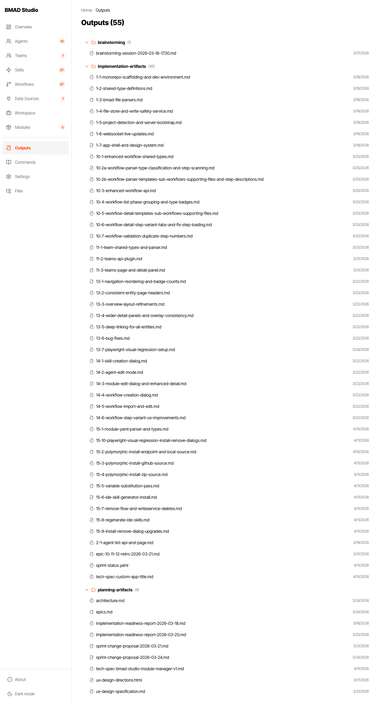

# BMAD Studio

Browser-based admin interface for the [BMAD](https://github.com/bmadcode/BMAD-METHOD) agentic engineering framework. Visualize, configure, and manage your BMAD project without leaving your browser.

BMAD Studio is the **configuration and visibility layer** for BMAD projects. It reads and writes BMAD's existing markdown and YAML files directly — no database, no hidden state. The IDE remains the execution environment; Studio helps you understand and manage the setup.

## Screenshots

### Overview Dashboard

The overview page surfaces everything at a glance — agents, teams, installed workflows, the BMAD process timeline, your toolkit, skills, and data sources.


### Agents

Browse all agents across installed modules. Each card shows the agent's icon, title, module source, and skill count.


### Modules

Install, manage, and export modules. Browse a shared registry or install from npm, GitHub, local path, or ZIP.


### Module Registry

Connect to a GitHub-based module registry to browse and install shared modules across your team.


### Teams

Create and manage agent teams for collaborative workflows and Party Mode.


### Outputs

Browse all project deliverables grouped by BMAD phase — brainstorming, implementation artifacts, and planning artifacts.



### Settings

Configure theme, port, module registry, and project settings.


### Files

Browse and navigate the raw BMAD file tree with folder hierarchy.


### Data Sources

View and manage IDE connections and external data sources.


## Features

- **Overview Dashboard** — Agents, teams, workflows, process timeline, toolkit stats, skills, and data sources at a glance
- **Agent Management** — Browse agents across modules, view skills and workflow roles, create overrides
- **Team Management** — Create and manage agent teams for collaborative workflows and Party Mode
- **Skill Library** — Browse, filter, search, create, and assign skills to agents
- **Workflow Visualization** — Step-by-step detail with variant tabs and module filtering
- **Output Hub** — Browse all deliverables grouped by BMAD phase
- **Module Management** — Install, remove, export, and create modules from npm, GitHub, local, or ZIP sources
- **Module Registry** — Connect to a shared GitHub-based registry to browse and install team modules
- **Data Sources** — View and manage IDE connections and external integrations
- **Workspace Editor** — Structured editor for project-context.md with per-section editing and rules management
- **Commands** — Browse all BMAD process triggers organized by phase, including Quick Flow and anytime commands
- **File Browser** — Navigate the raw `_bmad/` file tree with size indicators
- **Project Switching** — Switch between registered BMAD projects without restarting
- **Live Reload** — File system changes appear instantly via WebSocket
- **Dark/Light Theme** — Toggle between themes from Settings or the sidebar
- **Custom App Title** — Rebrand the header (e.g. "DEPT Agent Studio") via Settings

## Quick Start

### Using npx (recommended)

Navigate to your BMAD project root and run:

```bash
npx bmad-studio
```

Then open [http://localhost:4040](http://localhost:4040) in your browser.

Studio auto-detects your BMAD project by walking up the directory tree looking for a `_bmad/` directory with a valid module configuration.

### CLI Options

```bash
npx bmad-studio                         # Start on default port 4040
npx bmad-studio --port 8080             # Custom port
npx bmad-studio --dir /path/to/project  # Specify project directory
npx bmad-studio --verbose               # Enable debug logging to stdout
```

If the default port is in use, Studio will automatically try the next available port.

### From Source

```bash
git clone https://github.com/jwhiteside/bmad-studio.git
cd bmad-studio
npm install
npm run build
npm start
```

For development with hot reload:

```bash
npm run dev
```

This starts the Vite dev server on [http://localhost:5173](http://localhost:5173) and the API server on port 4040 concurrently.

## Prerequisites

- **Node.js** >= 20.0.0
- A **BMAD project** with a `_bmad/` directory at the project root ([BMAD v6+](https://github.com/bmadcode/BMAD-METHOD))

If no BMAD project is detected, Studio starts in setup mode with guidance on getting started.

## Configuration

### Studio Settings

Studio stores its settings in `.bmad-studio/settings.json` inside your project root. You can edit these through the Settings page in the UI or directly in the file:

```json
{
  "port": 4040,
  "theme": "light",
  "appTitle": "My Agent Studio",
  "registry": {
    "repo": "owner/repo",
    "branch": "main"
  },
  "logging": {
    "enabled": true,
    "level": "info"
  }
}
```

| Setting | Type | Default | Description |
|---------|------|---------|-------------|
| `port` | number | `4040` | Server port (requires restart) |
| `theme` | `"dark"` \| `"light"` | `"light"` | UI color theme |
| `appTitle` | string | `"BMAD Studio"` | Custom header title for branding |
| `registry.repo` | string | — | GitHub repo in `owner/repo` format for module registry |
| `registry.branch` | string | `"main"` | Branch to read registry from |
| `logging.enabled` | boolean | `false` | Enable file-based logging |
| `logging.level` | string | `"info"` | Log level: `trace`, `debug`, `info`, `warn`, `error` |

### BMAD Project Configuration

BMAD project settings live in `_bmad/core/config.yaml` and are managed by the BMAD installer:

```yaml
user_name: Jonathan
communication_language: English
document_output_language: English
output_folder: "{project-root}/_bmad-output"
```

### Runtime Files

Studio creates a `.bmad-studio/` directory in your project root for runtime state:

```
.bmad-studio/
  settings.json    # Studio configuration (see above)
  cache/           # Parsed entity cache for faster startup
  logs/            # Server logs (when logging is enabled)
  history/         # Change history
```

This directory is gitignored by default. Delete it to fully reset Studio — zero-footprint removal.

### Global State

Studio maintains a global registry of recent projects at `~/.bmad-studio/projects.json` (up to 10 entries). This enables the project switcher in Settings.

## Architecture

BMAD Studio is a monorepo with three packages:

```
packages/
  shared/    # TypeScript types shared between client and server
  server/    # Fastify 5 API — parses BMAD files, serves data, handles writes
  client/    # React SPA — Vite + Tailwind CSS + React Router
```

### Design Principles

1. **Lightweight** — Local, instant startup, no database, no external services
2. **File-system as source of truth** — Every change = file change, every file change = app update
3. **Zero-footprint removal** — Delete `.bmad-studio/` and it's gone
4. **Non-destructive** — Diff preview before every save, no silent overwrites
5. **IDE-agnostic** — Works with Claude Code, Cursor, Windsurf, GitHub Copilot, VS Code, JetBrains
6. **Configure, don't execute** — Studio sets up; the IDE runs

### Key Technologies

| Layer | Technology |
|-------|-----------|
| Client | React 19, React Router 7, Tailwind CSS 4, shadcn/ui, CodeMirror 6 |
| Server | Fastify 5, Chokidar (file watching), WebSocket (live updates) |
| Shared | TypeScript |
| Build | Vite, tsx (dev), Vitest + Playwright (testing) |

## BMAD Concepts

| Concept | What it is |
|---------|-----------|
| **Agent** | Markdown file defining an AI agent's role, persona, and skills |
| **Skill** | Markdown file defining a capability assignable to agents |
| **Workflow** | Structured markdown defining a sequence of steps with agents, inputs, and deliverables |
| **Team** | Named grouping of agents for collaborative workflows and Party Mode |
| **Module** | Versioned collection of agents, skills, workflows, and configuration for a specific domain |
| **Output** | Generated deliverable from a BMAD workflow (PRDs, architecture docs, stories, etc.) |
| **Command** | A BMAD process trigger organized by phase (Analysis, Planning, Solutioning, Implementation) |

### Modules

Modules are how BMAD extends its capabilities for specific domains. They can be installed from multiple sources:

| Source | Example |
|--------|---------|
| **npm** | `npx bmad-studio` installs from the npm registry |
| **GitHub** | Install from any GitHub repository |
| **Local** | Point to a directory on disk (useful during development) |
| **ZIP** | Upload a ZIP archive |
| **Built-in** | Core modules bundled with BMAD |

Each module can contain agents, skills, workflows, teams, and configuration. Studio's Modules page lets you browse installed modules, explore a shared registry, install new modules, and export existing ones.

For more on the BMAD method, see the [BMAD-METHOD repository](https://github.com/bmadcode/BMAD-METHOD).

## Contributing

See [CONTRIBUTING.md](CONTRIBUTING.md) for guidelines on reporting bugs, submitting pull requests, and development setup.

## License

[MIT](LICENSE)
