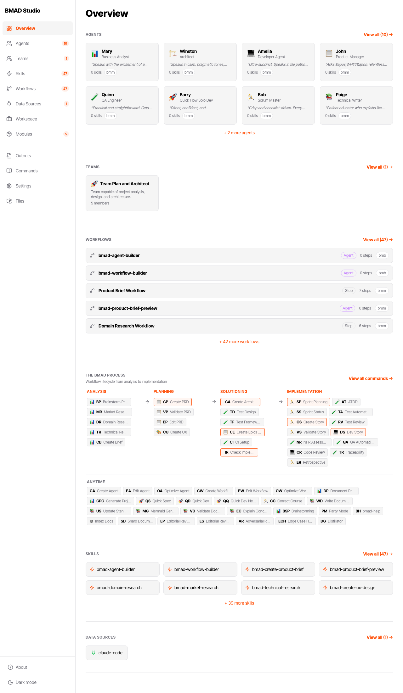

# BMAD Studio

Browser-based admin interface for the [BMAD](https://github.com/bmadcode/BMAD-METHOD) agentic engineering framework. Visualize, configure, and manage your BMAD project without leaving your browser.

BMAD Studio is the **configuration and visibility layer** for BMAD projects. It reads and writes BMAD's existing markdown and YAML files directly — no database, no hidden state. The IDE remains the execution environment; Studio helps you understand and manage the setup.

## Screenshots




## Features

- **Project Dashboard** — Sprint status, output hub, toolkit stats, and BMAD process visualization at a glance
- **Output Hub** — Browse all project deliverables grouped by BMAD phase (Analysis, Planning, Solutioning, Implementation)
- **Agent Management** — Browse agents, view their skills and workflow roles, edit overrides
- **Workflow Visualization** — Step-by-step detail with variant tabs, nested hierarchy, and phase timeline with Quick Flow bypass
- **Skill Library** — Browse, create, and assign skills to agents
- **Team Management** — Create and manage agent teams for collaborative workflows and Party Mode
- **Module Registry** — Browse, install, and manage modules from a central registry
- **Project Switching** — Switch between registered BMAD projects without restarting the server
- **Project Context Editor** — Structured editor for project-context.md with per-section editing and rules management
- **Live Reload** — File system changes appear instantly via WebSocket
- **Dark/Light Theme** — Automatic theme detection with manual toggle

## Quick Start

### Using npx (recommended)

Navigate to your BMAD project root and run:

```bash
npx bmad-studio
```

Then open [http://localhost:4040](http://localhost:4040) in your browser.

### Options

```bash
npx bmad-studio --port 8080        # Custom port
npx bmad-studio --dir /path/to/project  # Specify project directory
npx bmad-studio --verbose           # Debug logging
```

### From Source

```bash
git clone https://github.com/jwhiteside/bmad-studio.git
cd bmad-studio
npm install
npm run build
npm start
```

For development with hot reload:

```bash
npm run dev
```

This starts the Vite dev server on [http://localhost:5173](http://localhost:5173) and the API server on port 4040.

## Prerequisites

- **Node.js** >= 20.0.0
- A **BMAD project** with a `_bmad/` directory at the project root (BMAD v6+)

If no BMAD project is detected, Studio starts in setup mode with guidance on getting started.

## Architecture

BMAD Studio is a monorepo with three packages:

```
packages/
  shared/    # TypeScript types shared between client and server
  server/    # Fastify API — parses BMAD files, serves data, handles writes
  client/    # React SPA — Vite + Tailwind CSS + React Router
```

### Design Principles

1. **Lightweight** — Local, instant startup, no database, no external services
2. **File-system as source of truth** — Every change = file change, every file change = app update
3. **Zero-footprint removal** — Delete `.bmad-studio/` and it's gone
4. **Non-destructive** — Diff preview before every save, no silent overwrites
5. **IDE-agnostic** — Works with Claude Code, Cursor, Windsurf, GitHub Copilot, VS Code, JetBrains
6. **Configure, don't execute** — Studio sets up; the IDE runs

### Key Technologies

| Layer | Technology |
|-------|-----------|
| Client | React 18, React Router, Tailwind CSS, shadcn/ui, CodeMirror 6 |
| Server | Fastify 5, Chokidar (file watching), WebSocket (live updates) |
| Shared | TypeScript |
| Build | Vite, tsx (dev), Vitest (testing) |

## BMAD Concepts

| Concept | What it is |
|---------|-----------|
| **Agent** | Markdown file defining an AI agent's role, persona, and skills |
| **Skill** | Markdown file defining a capability assignable to agents |
| **Workflow** | Structured markdown defining a sequence of steps with agents, inputs, and deliverables |
| **Team** | Named grouping of agents for collaborative workflows and Party Mode |
| **Module** | Versioned collection of BMAD entities from an external repository |

For more on the BMAD method, see the [BMAD-METHOD repository](https://github.com/bmadcode/BMAD-METHOD).

## Contributing

See [CONTRIBUTING.md](CONTRIBUTING.md) for guidelines on reporting bugs, submitting pull requests, and development setup.

## License

[MIT](LICENSE)
